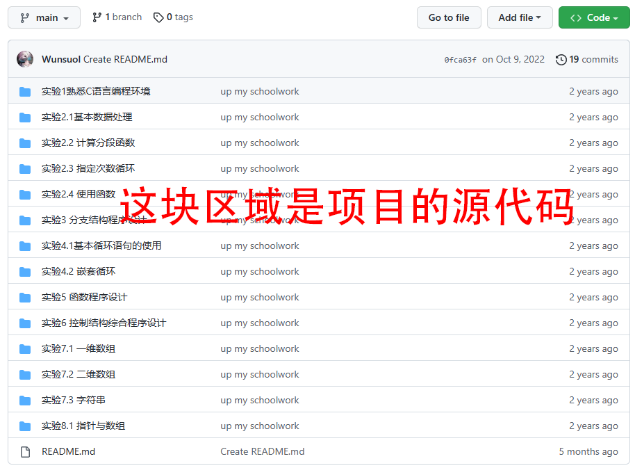
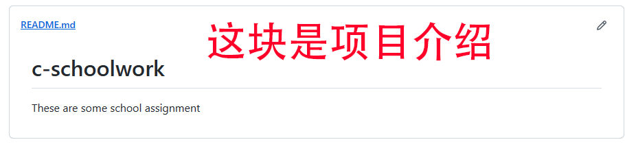
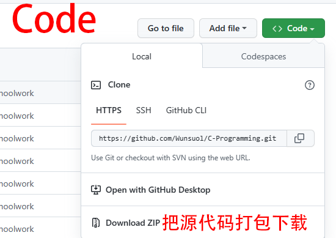

1.Github：是一个代码/文件托管+保管+提交修改+评论修改的工具。
2.GitHub：创建一个仓库。写过代码的朋友可以理解为一个项目，一个模块，一个主题。创建仓库需要指定用户，仓库名，保密性，开源协议。
3.Github：上传文件或者文件夹。点击addfile添加空文件或者上传若干文件，/表示文件夹，文件夹不可为空。
4.Github：贡献操作之提交疑问或者描述和总结（Issues）。基于查看过代码仓库的前提提交问题和提交说明，仓库创建者有权利关闭问题并和网友评论问题以及添加标签。
5.Github：贡献操作之提交更改（Pull Requests）。你看了人家仓库的东西觉得有地方需要改进，那就别只会比比，把东西改了给人加到仓库里合并，顺便添加描述。
6.Github：仓库可公开或私有，遵循开源协议的公开仓库代码都可以拿去学习，商用不行
7.Github：版本管理功能。写一堆拉基代码没法用想回退版本
8.Github：搜索资源
